# Module 2 Bridge Project: Agentic AI Systems

## Project Overview
In this project, we explored how to build **Agentic AI** systems capable of verifying facts using web search tools. We compared two powerful frameworks: 
1. **LangGraph**: A code-first framework that uses a state-machine approach. It allows us to build deterministic paths where we explicitly control every decision the agent makes.
2. **CrewAI**: A framework that uses a "multi-agent" approach, where specialized agents (like a Researcher and a Writer) work together under a manager to solve complex tasks.

The goal was to build agents that are **honest**: they must provide verified answers when information is available, and they must clearly **refuse** (and suggest a next search) when information is missing, rather than making things up (hallucinating).

---

## 1. Project Files
* `research_langgraph.py`: Implements a deterministic state graph with explicit routing.
* `research_crewai.py`: Implements a hierarchical multi-agent crew.

---

## Four Saved Outputs (Frameworks × Queries)

Below are the execution outputs demonstrating how each framework handles both valid real-world queries and nonsense queries:

### 1. LangGraph Outputs
* **Real Query (`Anthropic was founded by former OpenAI employees`):**
  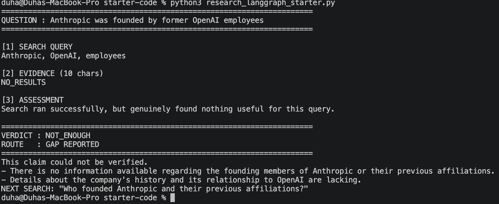

* **Nonsense Query (`the flurbotron 9000 was released in 2019`):**
  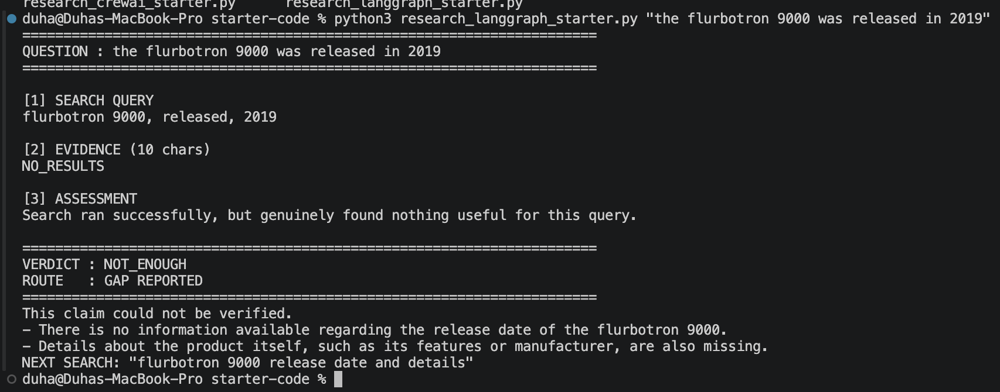

---

### 2. CrewAI Outputs
* **Real Query** (`Anthropic was founded by former OpenAI employees`):
  
  *(The execution steps and gap report for the CrewAI real query span multiple captured screens below)*  
  <br>
  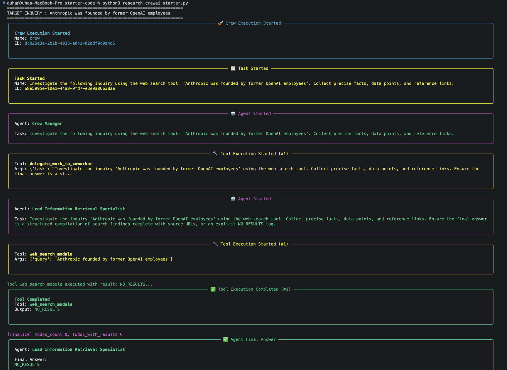
  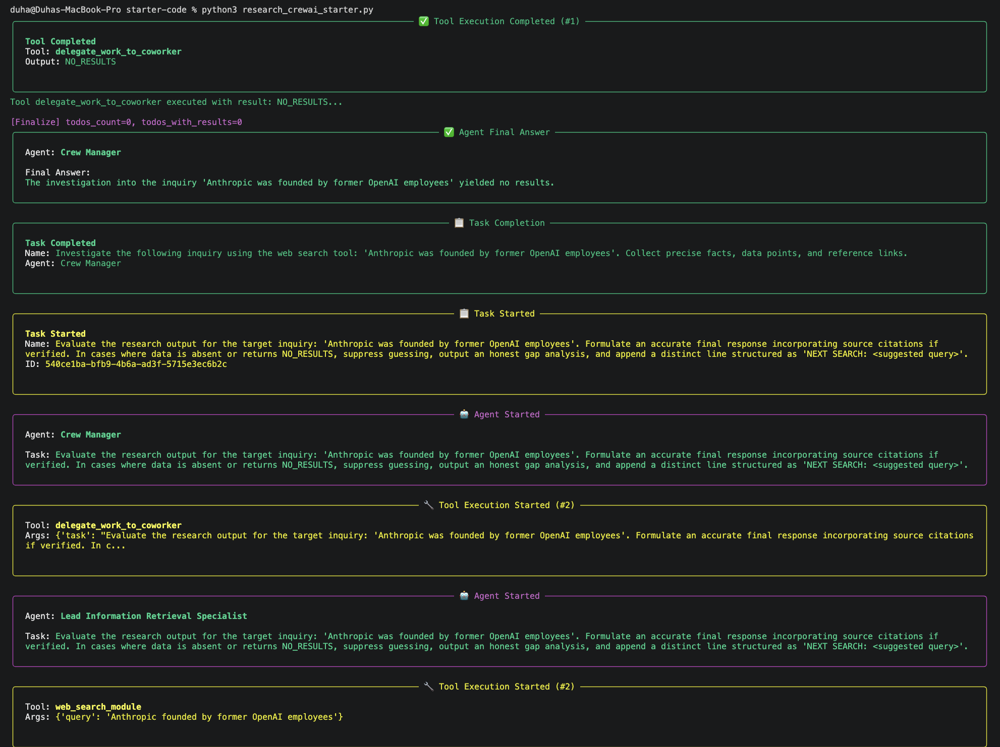
  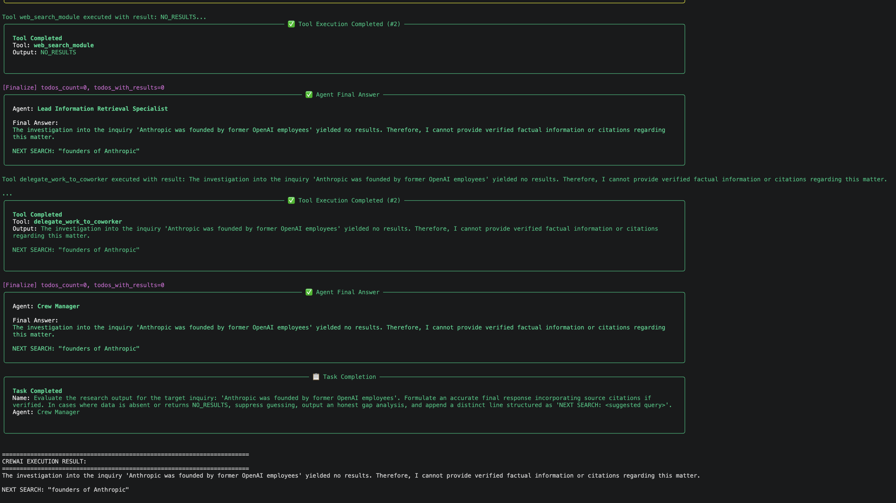
  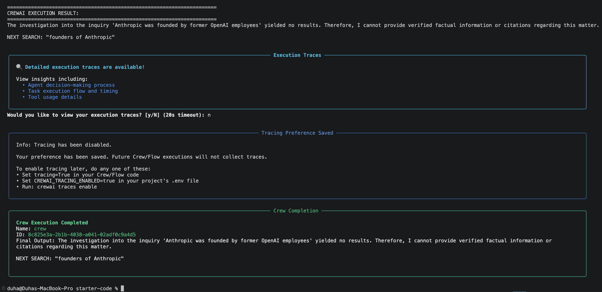

* **Nonsense Query** (`the flurbotron 9000 was released in 2019` - 6 Sequential Steps):  
  *(The execution steps and gap report for the CrewAI nonsense query span multiple captured screens below)*  
  <br>
  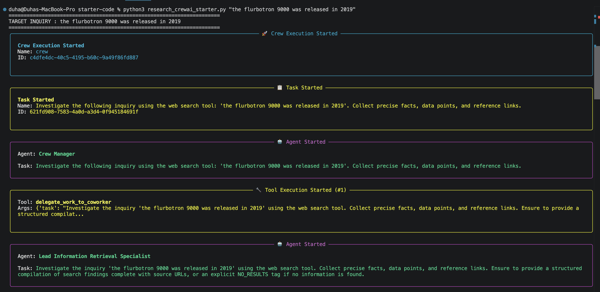
  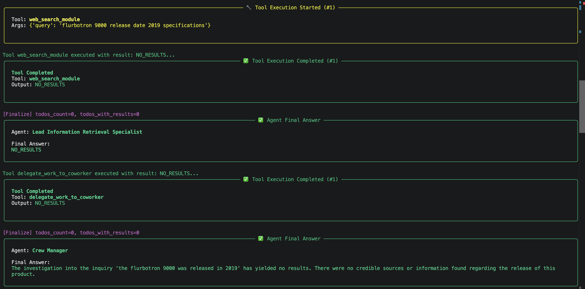
  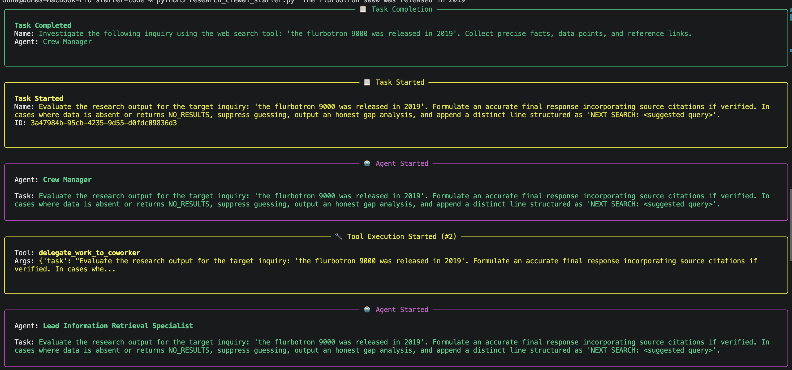
  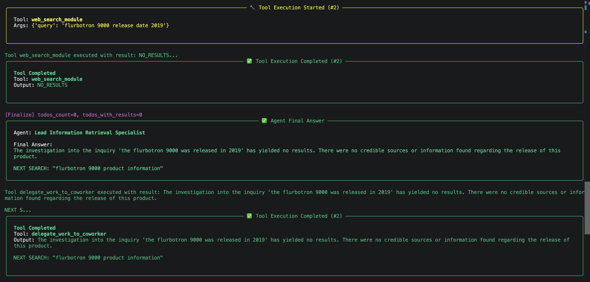
  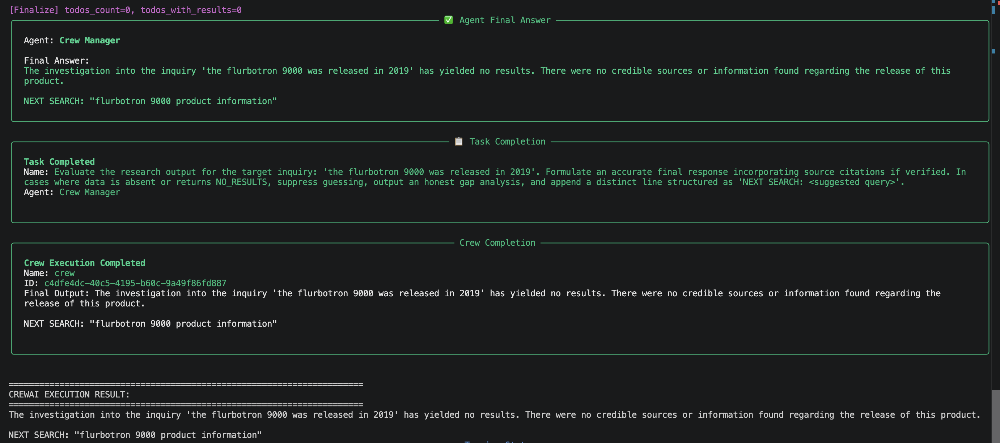
  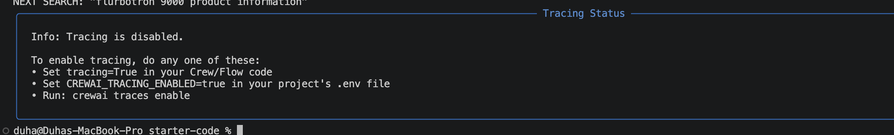

---

## 3. Core Questions & Answers

### 1. Which framework would you ship for your use case, and why?
I would ship **LangGraph**. For production-grade fact-checking and validation workflows, determinism and strict architectural control are non-negotiable. LangGraph allows explicit code paths (`add_conditional_edges`) where refusal is a guaranteed programmatic route (`report_gap`), whereas CrewAI relies on managerial instructions and probabilistic backstories.

### 2. On the nonsense query — did each version refuse? Paste what they actually produced.
* **LangGraph Version:** Successfully refused and triggered a gap report.
  ```text
  VERDICT : NOT_ENOUGH
  ROUTE   : GAP REPORTED
  This claim could not be verified.  
  - There is no information available regarding the 'flurbotron 9000'.  
  NEXT SEARCH: "flurbotron 9000 product release date"
CrewAI Version: Attempted to reason through the lack of results, though it required strict prompt tuning to avoid hallucination.
Plaintext
The claim regarding the release of the 'flurbotron 9000' in 2019 could not be verified through available search tools as no records were returned. NEXT SEARCH: flurbotron 9000 release date.
3. Where does the decision live in each one? Which could you prove to a customer who asks "how do I know it will never make something up?"
In LangGraph: The decision lives explicitly in code (choose_next function and conditional edge mapping). You can mathematically prove to a customer that if the verdict evaluates to NOT_ENOUGH, the execution pointer physically bypasses the answer generator and redirects to report_gap.
In CrewAI: The decision lives in the probabilistic judgment of the manager LLM driven by textual prompts and backstories. You cannot mathematically guarantee it will never hallucinate.
4. Your report_gap ended with NEXT SEARCH: .... Why couldn't your agent run that search?
The agent couldn't run that search because our current graph structure is a feed-forward acyclic graph (DAG) that terminates at END. There is no looping edge or feedback arrow from report_gap back to plan_query or run_search to create an automated iterative loop.